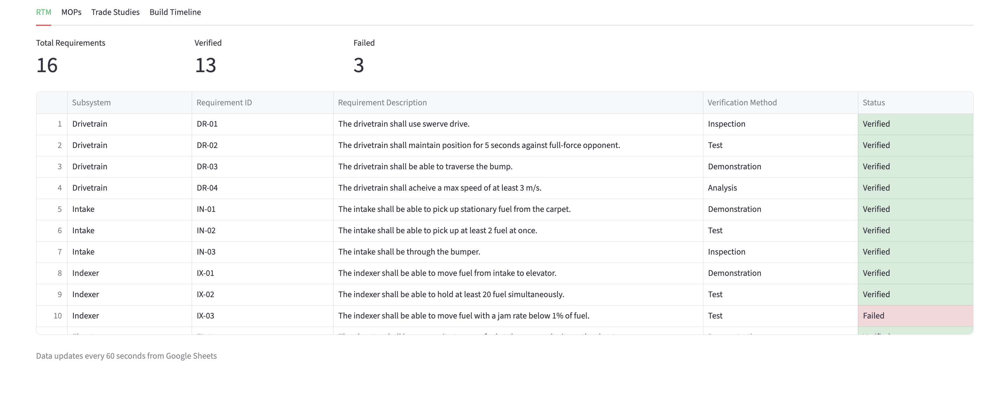

# FRC Systems Engineering Dashboard | TORCH 5804 🔥

Our indexer jammed at competition because we had no formal requirements for the indexer's design. We did not define a feed rate target or a jam rate tolerance. This dashboard models what systems engineering would have looked like applied to our robot and how systems techniques would have caught the problem before we ever got on the field. 

🔗 Dashboard Link: https://torch5804-se-dashboard.streamlit.app/

---

## The Problem

In the 2025-2026 season, TORCH had no formal requirements process. And we paid the price. At competition, our upper indexer bar jammed. We had no requirements to test against. We had no Measures of Performance to catch the failure before it happened. 

---

## What I Built

The dashboard contains 4 tabs, each applying a specific systems engineering tool to our robot's design process. 

### RTM (Requirements Traceability Matrix) 
- This matrix traces the base requirements of our design for each subsystem to a verification method and test. 
### MOPs (Measures of Performance) 
- This table quantifies actual results against defined targets to determine the status of the requirements from the RTM.
### Trade Studies 
- This tab documents the different design decisions we made using a weighted scoring matrix across specific criteria. 
### Build Timeline 
- This timeline visualizes the six week build season as a Gantt chart. Items on the critical path are highlighted in red, showing which tasks could not slip without delaying the entire build. 

---

## ISO 15288 Framework

| Feature | ISO 15288 Process |
|---|---|
| RTM | System Requirements Definition + Verification |
| MOPs | Measurement + Quality Assurance |
| Trade Studies | Decision Management |
| Build Timeline | Project Planning + Risk Management |

---

## Tech Stack

- Python / Streamlit
- pandas
- Plotly
- Google Sheets (live CSV backend)
- Streamlit Community Cloud

---

## What I Learned

- How to properly write requirements to keep design options open.
- How to properly create tests to verify defined design requirements. 
- How to apply a weighted scoring decision matrix to a design decision.
- How to use a Gantt chart to visualize a project timeline. I learned how to see which subsystems had float that masked how close we were to not implementing an indexer redesign.
  
---

## Known Limitations

- This data is simulated/reconstructed, not live sensor data.
- The timeline is approximate reconstruction from memory.
- There is no data validation layer.
- The dashboard operates as a single-user Streamlit instance.

---

## Screenshot

## Development Tools
Built with Claude and Claude Code for engineering guidance and development assistance.
